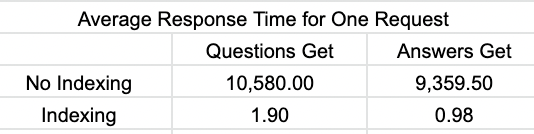
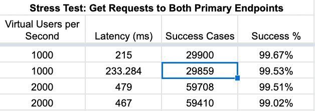
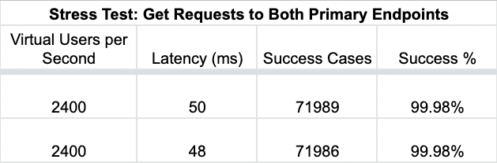

# Atelier: Database System Design, RESTful API
Developed RESTful API and database for an inherited front-end E-Commerce codebase with over 25M records in CSVs

## Tech

          

## About

System Design Capstone for Hackreactor. This is the reviews API for an eCommerce website that was divided into a service based architecture. The API, server, and database were designed to interface with an inherited front-end. After creating and optimizing the backend, it was load tested locally, dockerized, deployed on ec2 instances, and finally load tested again. To increase the throughput, the system was horizontally scaled by adding more servers with an nginx load balancer. 

##Metrics

### Performance Testing - Local
GOAL: All requests:
- Response time < 50ms / ideally 10ms

METHOD: Tested using PSQL 'explain analyze' cmd
- ProductId = 1

GOAL: All requests (Stress testing)
- Response time: less than 2,000ms / ideally 200ms
- Throughput: 1,000 RPS ideally 10,000rps

METHOD: Testing with K6
- Product ID: Randomized 1 - 500
- Duration: 1m

### Performance Testing - Deployed in AWS EC2 (t2.micros)
GOAL: Scale to
- Response time: less than 2000ms
- Throughput: 1000 RPS

METHOD: Testing with loader.io

CONSTRAINTS:
- No AWS Services: RDS, Elastic Beanstalk, etc
- Cannot VERTICALLY scale
- Must have < 1% error rate to pass

TEST:
- Single instance of Node server

RESULTS:
- All queries able to handle 1,500 RPS

TEST:
- Two instances of Node Server, with Nginx Load Balancing

Results:
- All Queries able to handle 2,400 RPS

### Future Development
- Compare performance with NoSQL database
- Scale to 4 instances for clarity on optimal Load Balancing methods
- Implement and utilize caching and worker connections on Load Balancer
